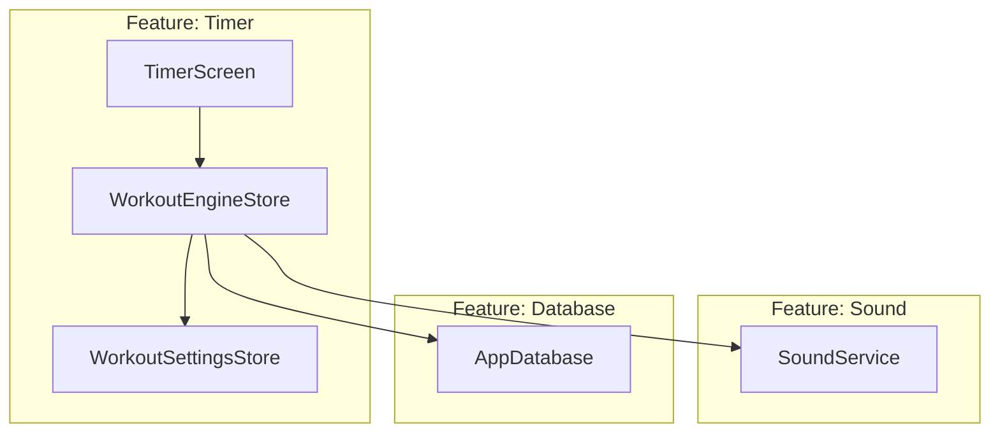

# wiseworkout

A new Flutter project.

## Getting Started

This project is a starting point for a Flutter application.

A few resources to get you started if this is your first Flutter project:

- [Lab: Write your first Flutter app](https://docs.flutter.dev/get-started/codelab)
- [Cookbook: Useful Flutter samples](https://docs.flutter.dev/cookbook)

For help getting started with Flutter development, view the
[online documentation](https://docs.flutter.dev/), which offers tutorials,
samples, guidance on mobile development, and a full API reference.

---

## 🏗️ Architecture & Dependency Flow

The project is designed using a highly decoupled, feature-driven state architecture with unidirectional dependency flows:

### Unidirectional Responsibilities

1. **`features/timer` (State & Execution):**
   * Manages all session execution states (`WorkoutEngineStore`) and pre-workout configs (`WorkoutSettingsStore`).
   * Reactively binds the passive UI (`TimerScreen`) to execution states using `signals_flutter`'s `.watch(context)`.
   * Drives the sound service and logs history entries, ensuring that state transitions naturally flow downwards.
2. **`features/sound` (Dumb Infrastructure Helper):**
   * Acts as a pure infrastructure service with **zero knowledge of workouts, stores, or sets**.
   * It exposes a standalone audio playing interface used by execution handlers.
3. **`features/database` (Data Persistence):**
   * Handles local drift persistence and records workout histories.
   * Completely isolated from state management or presentation layers.
